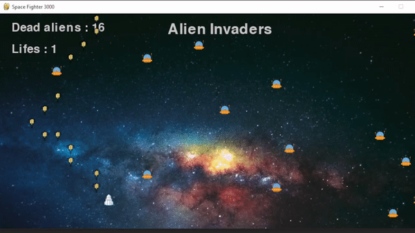

# Alien invaders
<br>
Alien Invadors is an game in Python. Where the main objective is the dustruction of Aliens.
The players have 5 lifes if they lose the five lives the payer lose the game .



## Usage

To use play this game you have to import the librery's : pygame , random and time.

```python
import time
import pygame
import random
import array as myarray
```

## Before run the game

Before run the script you have to make sure that the images path i'ts correct for you operating system. You can change the path in the parameters file 
(GameParemetters. py). 

## Instructions of the game

The spaceship is able to move up , move down , move to right and to move to the left:

```bash
** To move up           -> z
** To move down         -> s
** To move to the right -> d
** To move to the left  -> q
** To send a missil     -> g
** To exit the game     -> j
``` 

## To run the game ***

To run the game you have to do run the command line bellow in the inside the directory of the project :
```bash
python main.py
```